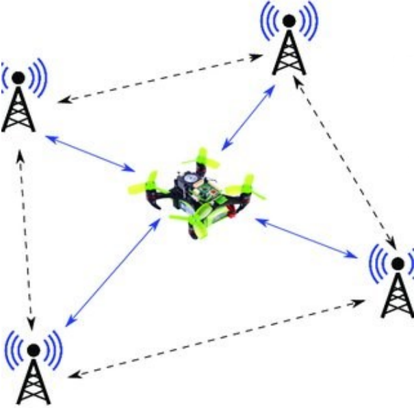

# Design for Unmanned Vehicle: Drone Estimator Project

This project is part of the **Design for Unmanned Vehicle** course. Throughout the course, we explored all the main topics related to Unmanned Aerial Vehicles (UAVs), including dynamics, control, estimation, and practical implementation.

## Project Overview

The objective of this project is to develop an estimator for a drone. The estimator consists of two main components:

- **Attitude Estimation:** Utilizes a MARG (Magnetic, Angular Rate, and Gravity) solution, incorporating data from the magnetometer and accelerometer.
- **Position Estimation:** Employs UWB (Ultra-Wideband) ranging sensors to determine the drone's position.



The entire project was simulated within a PX4 environment to ensure realistic performance and integration.

## Features

- **MARG-Based Attitude Estimation:** Accurate estimation of drone orientation using sensor fusion.
- **UWB Positioning:** Reliable position tracking through UWB ranging sensors.
- **Simulation Environment:** Comprehensive simulation setup using PX4 and Docker for easy deployment.
- **Modular Codebase:** Organized using `colcon` for efficient package management.

## Getting Started

### Prerequisites

- **Docker:** Ensure Docker is installed on your system. You can download it from [here](https://www.docker.com/get-started).
- **Git:** To clone the repository. Download it from [here](https://git-scm.com/downloads).

### Installation

1. **Clone the Repository**
    ```bash
    git clone https://github.com/your-username/your-repo-name.git
    cd your-repo-name
    ```

2. **Build the Docker Image**
    ```bash
    docker build -t drone-estimator .
    ```

3. **Run the Simulation**
    ```bash
    docker run -it drone-estimator
    ```

### Running the Simulation

The simulation environment is set up using PX4 within Docker. Once the Docker container is running, all necessary `colcon` packages will be executed automatically. Ensure that your system meets the Docker requirements and that you have sufficient resources allocated for the simulation.

## Repository Structure

